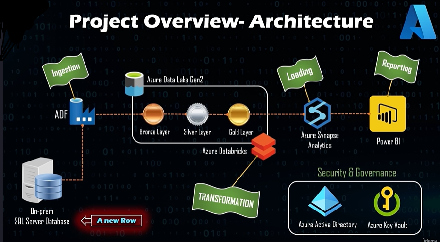
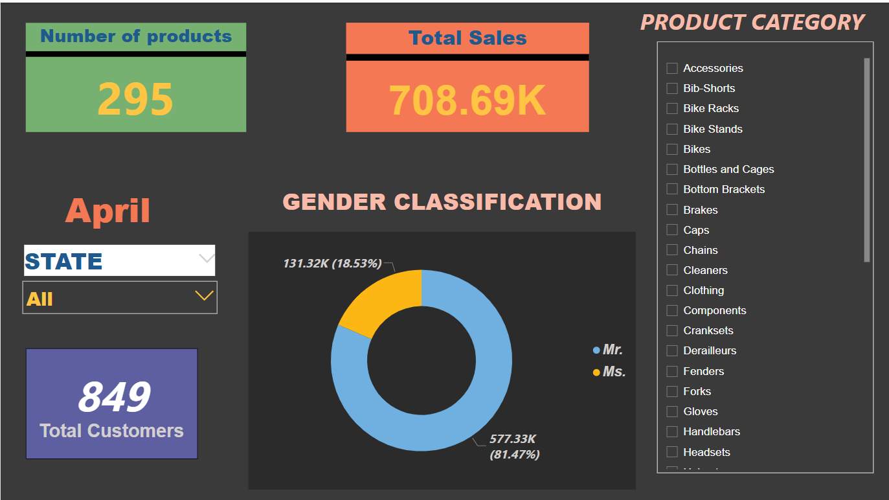
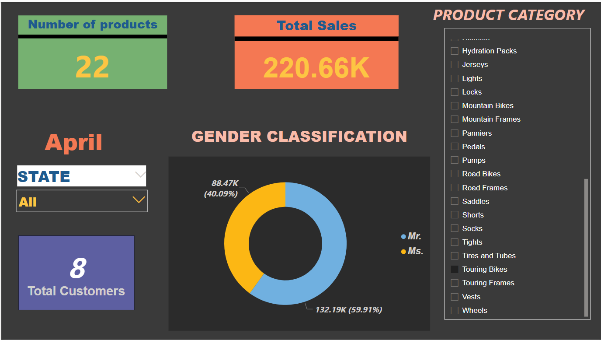

# 🚀 Azure_DE_Pipeline

This project demonstrates a complete **end-to-end Data Engineering pipeline** built using various **Azure services**. It covers the flow of data from on-premises sources to cloud-based transformation, storage, and visualization using modern tools like **Azure Data Factory**, **Azure Databricks**, **Azure Synapse Analytics**, and **Power BI**.

---

## 🧠 Project Architecture

This pipeline follows the modern **Medallion Architecture** approach:

- **Ingestion** via ADF from on-prem SQL Server to Azure Data Lake Gen2.
- **Transformation** from Bronze → Silver → Gold layers using Databricks notebooks.
- **Loading & Reporting** into Synapse and Power BI for data visualization.
- **Security & Governance** managed using Azure Key Vault and Active Directory.

---

## 📌 Project Overview

This project simulates a real-world cloud data pipeline setup, designed to handle:
- Structured data from an on-prem SQL Server source
- Data orchestration and automation using Azure Data Factory
- Transformation logic in notebooks using PySpark in Azure Databricks
- Scalable storage and analytics using Synapse Analytics
- Dashboarding and reporting with Power BI
- Secret and credential management via Azure Key Vault

It showcases **data engineering best practices** like modular pipeline design, separation of compute/storage, and secure resource access.

---

## 🛠️ Tools & Technologies Used

| Technology             | Purpose                                             |
|------------------------|-----------------------------------------------------|
| **Azure Data Factory** | Orchestrate and automate data pipelines             |
| **Azure Databricks**   | Clean and transform data using PySpark              |
| **Azure Synapse**      | Analyze and store structured data                   |
| **SQL Server (SSMS)**  | On-prem data source (AdventureWorksLT2022)          |
| **Power BI**           | Visualize data and build dashboards                 |
| **Azure Storage**      | Staging & lake storage using Gen2                   |
| **Azure Key Vault**    | Store credentials securely                          |
| **Azure AD**           | Access & identity management                        |
| **GitHub**             | Version control and project repository              |

---

## 🔄 Pipeline Flow

1. **Source**: On-prem SQL Server database (AdventureWorksLT2022).
2. **Ingestion**: ADF ingests raw data into the **Bronze Layer** (Data Lake).
3. **Transformation**: Databricks processes data → **Silver & Gold Layers**.
4. **Loading**: Gold-layer data loaded into Synapse.
5. **Visualization**: Power BI connects to Synapse for reporting.
6. **Orchestration**: ADF coordinates the end-to-end pipeline execution.

---

## 📈 Power BI Dashboard Highlights

- ✅ Total Customers
- ✅ Total Sales
- ✅ Sales by Product Category
- ✅ Customer Gender Distribution
- ✅ Interactive filters & slicers

---
## 📈 Power BI Dashboard Snapshots

